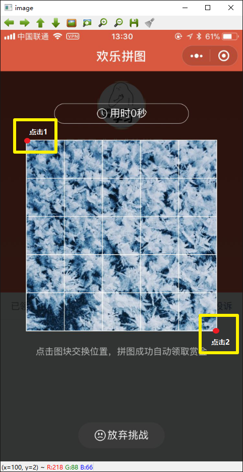
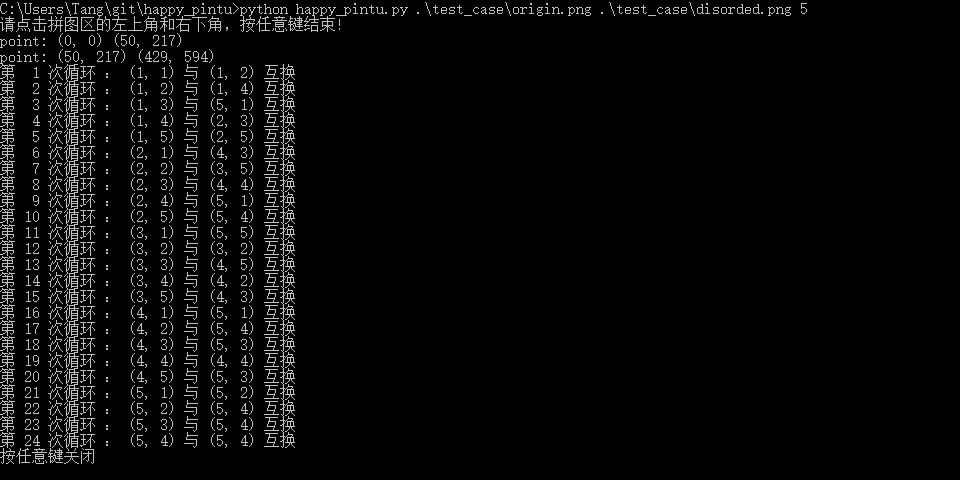

# 微信小程序天天拼图 - 辅助工具

## 使用说明

### 步骤说明

1. 进入游戏，点击开始时候，立刻截一张图，这张图是拼图的圆图。
2. 等原图打乱后，再截一张图。
3. 将两张图传到电脑上
4. 运行pyhton happy_pintu.py [原图路径] [打乱的图路径] [难度（简单：3；中等：4；复杂：5）]
5. 程序运行后，按照提示，点击拼图区域的左上角和右下角，按任意键继续。
6. 根据终端显示的计算结果，手动完成拼图
7. 按任意键关闭程序

### 例子说明

1. git clone git@github.com:himingway/happy_pintu.git 
2. python happy_pintu.py ./test_case/origin.png ./test_case/disorded.png 5 
(windows用户输入：python happy_pintu.py .\test_case\origin.png .\test_case\disorded.png 5)
3. 
4. 

## Python 运行依赖

```
opencv-python
operator
sys
tkinter
```